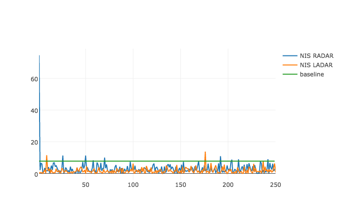
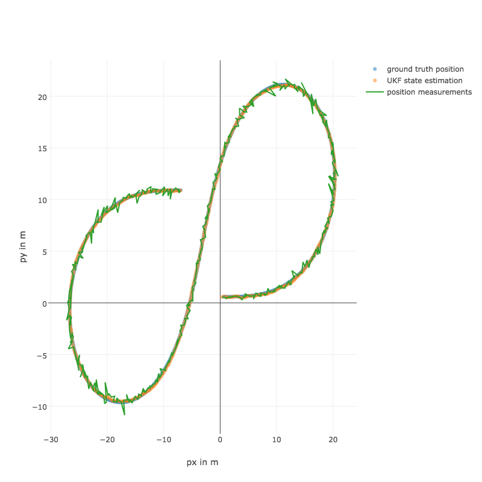

PROJECT DESCRIPTION
The project "unscented Kalman filter" is based on the same structure as the extended Kalman filter.
It uses a main file that calls a function called ProcessMeasurement. Anything important happens in this function. The function is part of the class ukf.

#### C++ QUIZZES
The quizzes including the solutions of them are included in the file ukf.cpp. They are individual functions, which don't need any special environment. The solution of the quizzes are given here and also the expected results.
The quizzes can easily evaluated: if every value of the student solution (vectors and matrices) differs less than 0.001 from the original solution, the quiz is passed, otherwise failed.

#### PROJECT PASSING CRITERIA
There are several criteria that must be fulfilled to pass the project.  

- The overall processing chain (prediction, laser update or radar update depending on measurement type) must be correct.  

- The student is not allowed to use values from the future to reason about the current state.  

- It must be possible to run the project in three different modes: considering laser only, with considering radar only, or with using both sensors.  

- For every mode, the overall RMSE (2d position only) may not be more than 10% increased to what the original solution is able to reach (this number depends on the individual measurement sequence)  

- The RMSE of laser AND radar must be lower than radar only or laser only  

Here are my results:  

|RMSE|px|py|vx|vy|
|----|----|----|----|----|
|LIDAR|0.110126|0.0970114|0.57023|0.245977|
|RADAR|0.152697|0.21261|0.382004|0.305366|
|BOTH|0.0704465|0.0810925|0.33549|0.232682|

- The NIS of radar measurements must be between 0.35 and 7.81 in at least 80% of all radar update steps.

The script for these plots are in `.plot_gen.ipynb`.  

  

#### PROJECT GRADING
- I recommend a hall of fame for the lowest overall RMSE using laser AND radar.
- I recommend to ask students to improve the initialization procedure and evaluate the RMSE during the first 20 steps.

